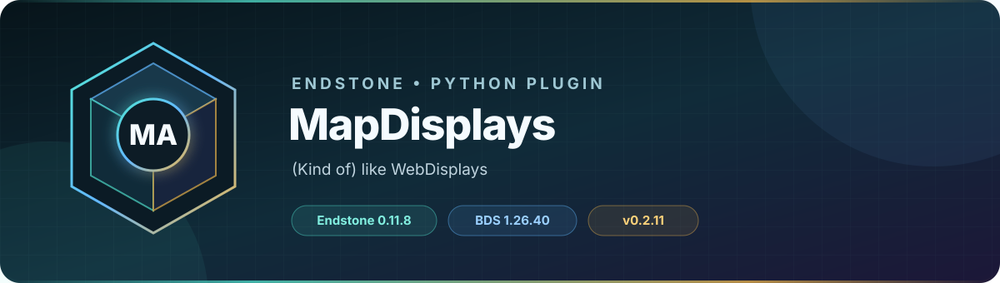

<!-- endstone-professional-header:start -->
<p align="center">
  
</p>

<p align="center">
  <a href="https://github.com/TheNINJALLO/endstone-mapdisplays/actions/workflows/wheel-release.yml"></a>
  <a href="https://github.com/TheNINJALLO/endstone-mapdisplays/releases/latest"></a>
</p>

<p align="center">
  
  
  
  =3.10" src="https://img.shields.io/badge/Python-%3E=3.10-3776AB?style=flat-square&amp;logo=python&amp;logoColor=white">
</p>

<p align="center">
  <strong>(Kind of) like WebDisplays.</strong>
</p>

<p align="center">
  <a href="#what-it-does">What it does</a> &bull;
  <a href="#how-to-use">How to use</a> &bull;
  <a href="#commands-and-permissions">Commands</a> &bull;
  <a href="#install">Install</a> &bull;
  <a href="https://github.com/TheNINJALLO/endstone-mapdisplays/releases">Releases</a>
</p>

## Overview

(Kind of) like WebDisplays. This release is aligned with Endstone 0.11.9 and Minecraft Bedrock Dedicated Server 1.26.44, and is distributed as a Python wheel for direct installation in an Endstone server.

## What it does

- Creates single- or multi-map image displays from local files and remote image URLs.
- Slices images across configured rows and columns and gives the resulting maps to players.
- Persists named displays and can broadcast updated map data to online clients.

## How to use

1. Create a display grid with `/display create <name> <cols> <rows>`.
2. Load an image with `/display set <name> <URL-or-local-path>`.
3. Give its maps with `/display give <name>` and place them in item frames in numerical order.
4. Use `/display broadcast <name>` after changing an image that current players should refresh.

## Commands and permissions

| Command / usage | What it does | Access |
|---|---|---|
| `/display create <name: str> <cols: int> <rows: int> [broadcast: bool]`<br>`/display set <name: str> <source: str>`<br>`/display give <name: str> [start: int] [player: player]`<br>`/display broadcast <name: str>`<br>`/display delete <name: str>`<br>`/display list` | manage static map displays and announcements | `mapdisplay.command.manage` |

## Compatibility

| Component | Supported version |
|---|---|
| Endstone | `0.11.9` |
| Endstone API | `0.11` |
| Bedrock Dedicated Server | `1.26.44` |
| Python | `>=3.10` |
| Plugin release | `v0.2.12` |

## Install

Download the wheel from the matching GitHub release:

```bash
gh release download v0.2.12 --repo TheNINJALLO/endstone-mapdisplays --pattern "*.whl"
```

Copy the downloaded wheel into the server's `plugins/` directory, remove any older wheel for the same plugin, and restart Endstone.

> [!IMPORTANT]
> Use Endstone `0.11.9` with BDS `1.26.44`. Back up worlds and plugin data before upgrading a production server.

## Configuration and secrets

Runtime databases, logs, local `.env` files, server directories, and root `config.toml` files are excluded from source releases. When an example configuration is provided, copy it locally and keep live tokens, passwords, webhook URLs, and server identifiers out of Git.

## Release automation

Every `v*` tag runs [the wheel release workflow](.github/workflows/wheel-release.yml), builds the package in a clean GitHub runner, stores the wheel as a workflow artifact, and attaches it to the matching GitHub release.
<!-- endstone-professional-header:end -->

---

## Project guide

An Endstone plugin that renders static images across one or more item-frame maps.
Use it for server announcements, spawn boards, montly banners — anything you can push as an image.

---

## Commands

All management is done through the `/display` command.

### `/display create <name> <cols> <rows>`
Creates a new named display board and gives you the physical map items.
- `name` — a unique identifier for this display (e.g. `announcements`, `spawnboard`)
- `cols` — number of maps wide
- `rows` — number of maps tall

Place the maps into item frames on your wall from **top-left → top-right, then next row**.

**Example:** `/display create spawnboard 3 2` → gives you 6 maps for a 3-wide × 2-tall grid.

---

### `/display set <name> <source>`
Loads an image onto an existing display. Works in two ways:

#### From a URL
```
/display set announcements https://i.imgur.com/abc123.png
```
Any direct image link works (Imgur, Discord CDN, your own web host, etc.)

#### From a local file
```
/display set announcements announcement_april.png
```
Upload the file to your server at:
```
/home/container/plugins/endstone-mapdisplays/
```
Then use just the filename as the `source`.

---

### `/display give <name> [player]`
Gives the map items for an existing display to yourself or another player.
Use this to hand out the `announcements` map to new players, or replace lost maps.

**Examples:**
```
/display give announcements
/display give announcements Steve
```

---

## Folder Structure (on the server)

```
plugins/endstone-mapdisplays/
├── announcement_april.png   ← upload your local images here
├── spawn_banner.jpg
└── data/
    └── displays.json        ← auto-generated, do not edit manually
```

---

## Typical Workflows

### Monthly Announcement Map
1. `/display create announcements 1 1`
2. Hand the map to players (or distribute via kit plugin)
3. Each month, upload your new image to the plugin folder and run:
   `/display set announcements april_news.png`
   — or paste a direct URL instead —
   `/display set announcements https://yourhost.com/april.png`

### Large Spawn Board (e.g. 3×2 item frames)
1. Build your item frame grid on the wall
2. `/display create spawnboard 3 2` — you get 6 maps
3. Place maps into frames top-left → bottom-right
4. `/display set spawnboard https://link.to/banner.png`

---

## Notes
- Images are automatically scaled to fit the display dimensions
- Displays persist across server restarts via `displays.json`
- The image is re-applied on every server startup from the last `source`
- Both `.png` and `.jpg` formats are supported
